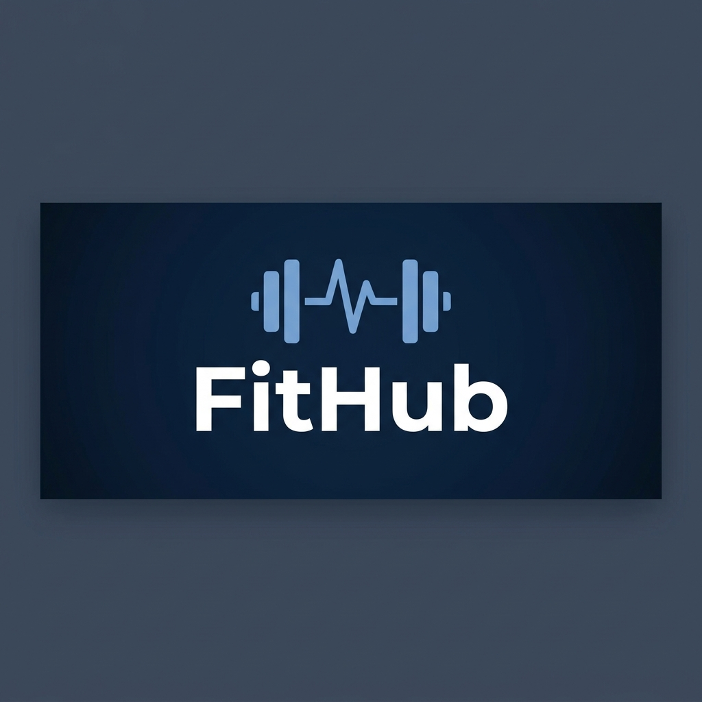

<div align="center">



# FitHub

**A local-first personal fitness & wellness tracker — no account, no cloud, no compromise.**

[](https://react.dev/)
[](https://vite.dev/)
[](LICENSE)
[](https://github.com/ashiqur-r-rahman/FitHub/tree/main)
[](https://github.com/ashiqur-r-rahman/FitHub/tree/rofaz)
[](https://github.com/ashiqur-r-rahman/FitHub/tree/talha)

</div>

---

## Table of Contents

- [Overview](#overview)
- [Branches](#branches)
- [Features](#features)
- [Tech Stack](#tech-stack)
- [Project Structure](#project-structure)
- [Design System](#design-system)
- [Getting Started](#getting-started)
- [Available Scripts](#available-scripts)
- [Production Build](#production-build)
- [Privacy](#privacy)
- [Contributing](#contributing)
- [Contributors](#contributors)
- [License](#license)

---

## Overview

FitHub is a **zero-login, privacy-first** fitness web application built with React and Vite. All user health data is stored exclusively in the browser's `localStorage` — no backend server, no database, no external tracking. Users open the application, enter their personal metrics, and immediately receive actionable health insights alongside a full suite of tracking and goal management tools.

The application is designed to be installable and runnable entirely offline, making it suitable for users who prioritize data ownership and personal privacy.

---

## Branches

This repository follows a feature-branch collaboration model. Each contributor develops on their own named branch before merging into `main`.

| Branch | Purpose | Link |
|---|---|---|
| `main` | Stable, integrated release branch | [View](https://github.com/ashiqur-r-rahman/FitHub/tree/main) |
|`shohag` | resolved issus and intregreated componets ,project creator[view](https://github.com/ashiqur-r-rahman/FitHub/tree/shohag)|
| `rofaz` | Feature development — health metrics engine, onboarding, dashboard, tracking tabs, task manager, settings | [View](https://github.com/ashiqur-r-rahman/FitHub/tree/rofaz) |
| `talha` | Feature development — additional contributor work | [View](https://github.com/ashiqur-r-rahman/FitHub/tree/talha) |

---

## Features

### Health Metrics Engine

All health calculations are performed client-side in real time using clinically recognized formulas. No data is transmitted externally.

| Metric | Formula / Method | Output |
|---|---|---|
| **BMI** | `weight(kg) / height(m)²` | 4-zone classification: Underweight, Normal, Overweight, Obese |
| **BMR** | Mifflin-St Jeor equation (gender-aware) | Resting calorie expenditure (kcal/day) |
| **TDEE** | BMR × activity level multiplier | Total daily calorie target (kcal/day) |
| **Ideal Weight Range** | BMI 18.5–24.9 back-calculated per height | Minimum and maximum healthy weight (kg or lbs) |
| **Daily Water Intake** | `weight(kg) × 0.033` | Recommended daily fluid intake (litres / glasses) |
| **Unit Conversion** | Bi-directional Metric ⇄ Imperial helpers | cm ↔ ft-in, kg ↔ lbs |

---

### 3-Step Carousel Onboarding

A guided, multi-step onboarding flow that auto-saves each step to `localStorage`, allowing users to resume at any point without data loss.

| Step | Title | Description |
|---|---|---|
| 1 | Basic Info | Name, age, gender, height, and weight with inline unit-toggle pills (Metric / Imperial) |
| 2 | Interests | Multi-select activity cards: Running, Gym, Yoga, Cycling, Swimming, Sports, Home Workout, Walking, Dance, Martial Arts |
| 3 | Commitment | Personalized wellness goal tag pills, a commitment contract pre-filled with the user's name, agreement checkbox, and final CTA button |

---

### Graphical Health Dashboard

| Component | Description |
|---|---|
| **BMI Gauge** | SVG arc gauge with a dynamic needle pointer and a color-coded classification badge |
| **Weight Trend Chart** | Interactive bar/line chart displaying logged weight history, inline entry form, and ±kg difference tags between entries |
| **Stat Cards** | Displays BMI, BMR, TDEE, Ideal Weight Range, and an interactive Water Intake tracker with `+` / `−` glass controls |

---

### Tracking Tabs

Three dedicated tracking tabs, each implementing a consistent **Record → Tracking → Recommendation** sub-panel architecture.

| Tab | Record | Tracking | Recommendation |
|---|---|---|---|
| **Exercise** | Workout type, duration, intensity, estimated calories burned | Active streak counter, session history log | Hobby-tailored workout suggestions based on user interests |
| **Food** | Meal name, macros (protein / carbs / fat), calorie count | Calorie budget progress bar vs. TDEE target | Nutrition and meal planning tips |
| **Sleep** | Bedtime and wake time entry, sleep quality rating | 7-day sleep duration chart with trend visualization | Optimal sleep window guidance based on logged patterns |

---

### Kanban Task Manager

A lightweight, 3-state task management board for tracking personal fitness goals and commitments.

```
To Do  ──►  In Progress  ──►  Completed
```

**Capabilities:**

- Single-click status cycling between all three states
- Filter view by status: `All`, `To Do`, `In Progress`, `Done`
- Category tag assignment per task
- Completion percentage indicator
- Individual task deletion

---

### Profile, Settings, and Privacy

| View | Description |
|---|---|
| **Profile** | Inline editing of personal metrics; triggers metric recalculation with a confirmation toast on save |
| **Settings** | Metric ⇄ Imperial unit preference toggle, daily reminder notification switches, and a guarded Reset App Data confirmation modal |
| **Privacy Policy** | In-app declaration of the local-first data model, explaining `localStorage` usage and confirming zero cloud storage, zero tracking, and zero cookies |

---

## Tech Stack

| Technology | Version | Role |
|---|---|---|
| [React](https://react.dev/) | 19 | UI component framework |
| [Vite](https://vite.dev/) | 8 | Build tool and development server |
| [Lucide React](https://lucide.dev/) | 1.29 | SVG icon library |
| [LocalStorage API](https://developer.mozilla.org/en-US/docs/Web/API/Window/localStorage) | Web Standard | Client-side persistent data storage |
| [Oxlint](https://oxc.rs/docs/guide/usage/linter.html) | 1.75 | High-performance JavaScript/JSX linter |

---

## Project Structure

```
FitHub/
├── client/
│   ├── public/                        # Static assets served at root
│   ├── src/
│   │   ├── components/
│   │   │   ├── dashboard/             # BmiGauge, WeightTrendChart, HealthOverview
│   │   │   ├── onboarding/            # StepBasicInfo, StepInterests, StepCommitment
│   │   │   ├── taskmanager/           # TaskManager (Kanban board)
│   │   │   └── tracking/              # ExerciseTab, FoodTab, SleepTab
│   │   ├── utils/
│   │   │   └── healthCalculations.js  # All health metric formulas and unit converters
│   │   ├── App.jsx                    # Root component and routing logic
│   │   ├── App.css                    # Design system tokens and layout grid
│   │   └── index.css                  # Global resets and base styles
│   ├── index.html
│   ├── package.json
│   ├── vite.config.js
│   └── .oxlintrc.json                 # Linter configuration
├── DOCUMENTATION.md                   # Full collaboration and commit history report
└── README.md
```

---

## Design System

The application uses a structured color palette defined as CSS custom properties across `App.css` and `index.css`.

| Token | Hex | Usage |
|---|---|---|
| Deep Navy | `#0B1F3A` | Primary background, sidebar |
| Steel Blue | `#3A5A8C` | Card backgrounds, borders |
| Sky Blue | `#7FA8D9` | Interactive elements, highlights |
| Pale Blue | `#DCE8F7` | Subtle backgrounds, hover states |
| White | `#FFFFFF` | Text on dark backgrounds, surfaces |

**Layout:** Desktop 3-column grid — Navigation Sidebar (~220 px) | Main Content (fluid) | Task Manager Panel (~320 px) — with responsive stacking for mobile viewports.

---

## Getting Started

### Prerequisites

- [Node.js](https://nodejs.org/) v18 or higher
- npm v9 or higher

### Installation and Development

```bash
# Clone the repository
git clone https://github.com/ashiqur-r-rahman/FitHub.git
cd FitHub

# Install client dependencies
npm --prefix client install

# Start the development server
npm --prefix client run dev
```

The application will be available at [http://localhost:5173](http://localhost:5173).

To work on a specific contributor branch:

```bash
# Switch to the rofaz branch
git checkout rofaz

# Switch to the talha branch
git checkout talha
```

---

## Available Scripts

All scripts are run from the repository root using the `--prefix client` flag.

| Command | Description |
|---|---|
| `npm --prefix client run dev` | Start the Vite development server with hot module replacement |
| `npm --prefix client run build` | Compile and bundle the application for production |
| `npm --prefix client run preview` | Serve the production build locally for verification |
| `npm --prefix client run lint` | Run Oxlint static analysis across all source files |

---

## Production Build

```
vite v8.2.1 building client environment for production...
transforming...
✓ 1807 modules transformed.

dist/index.html                   0.45 kB │ gzip:  0.29 kB
dist/assets/index-BxXVOKa9.css   23.02 kB │ gzip:  4.42 kB
dist/assets/index-CmFF1h3B.js   254.01 kB │ gzip: 76.51 kB

✓ built in 78ms
```

The production output is written to `client/dist/` and can be served by any static file host (e.g., Nginx, GitHub Pages, Vercel, Netlify).

---

## Privacy

FitHub is designed with **privacy by default**. The application makes no external network requests involving personal health data.

| Guarantee | Detail |
|---|---|
| Local storage only | All data is stored in `localStorage` on the user's own device |
| No authentication required | No account creation, no login, no personal identifiers collected |
| No cloud synchronization | Data never leaves the browser |
| No third-party tracking | No analytics, advertising, or telemetry scripts |
| User-controlled reset | All data can be permanently deleted via **Settings → Reset App Data** |

---

## Contributing

Contributions are welcome. Please follow the workflow below to ensure a clean integration with the main branch.

1. Fork the repository on GitHub
2. Create a descriptively named feature branch: `git checkout -b feat/your-feature-name`
3. Commit your changes using [Conventional Commits](https://www.conventionalcommits.org/) format: `git commit -m "feat(scope): description"`
4. Push the branch to your fork: `git push origin feat/your-feature-name`
5. Open a Pull Request against `main` with a clear description of the changes

**Commit type prefixes:** `feat`, `fix`, `docs`, `refactor`, `style`, `test`, `chore`

---

## Contributors

This project was developed collaboratively. All contributors are credited equally.

| Name | GitHub | Branch |
|---|---|---|
| Ashiqur Rahman | [@ashiqur-r-rahman](https://github.com/ashiqur-r-rahman) | `main` |
| Talha Jubair | [@TalhaJubair35](https://github.com/TalhaJubair35) | `talha` |
| Md. Rofaz Hasan Rafiu | [@rofazhasan](https://github.com/rofazhasan) | `rofaz` |

---

## License

This project is licensed under the **MIT License**. See the [LICENSE](LICENSE) file for details.
